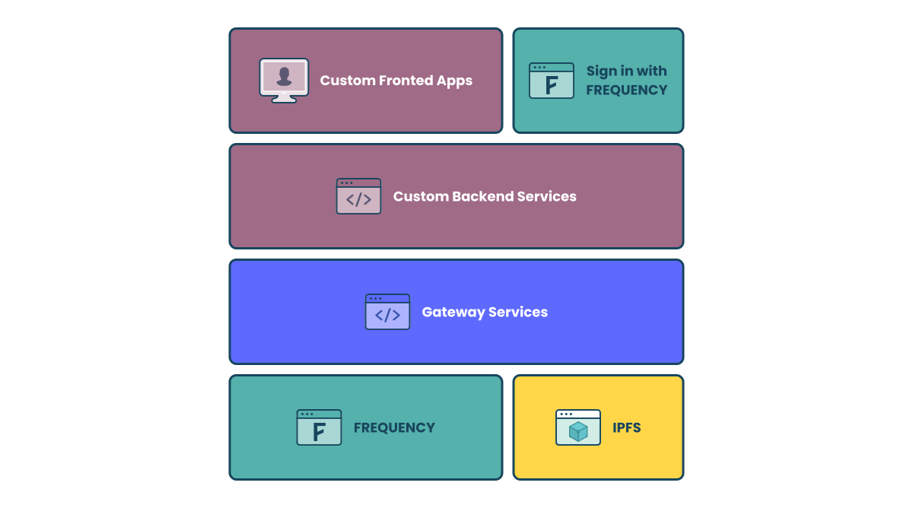
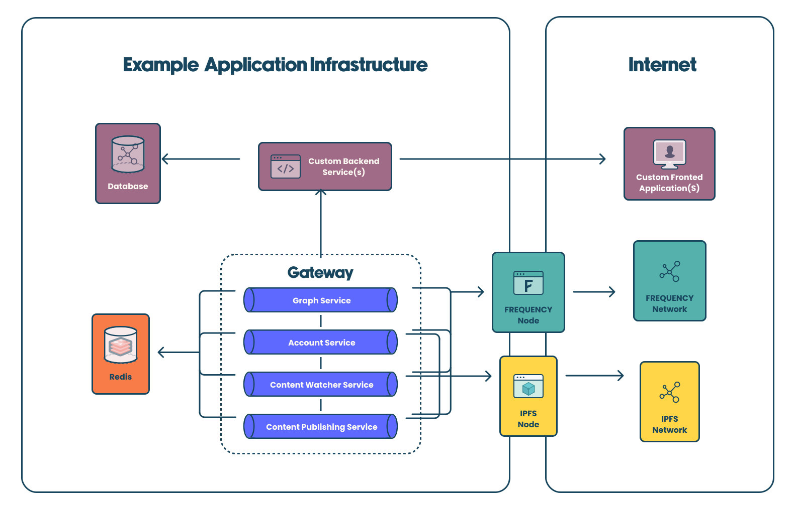

# Making Decentralized Social Easy with the Frequency Developer Gateway

The [Frequency Developer Gateway](https://....) offers a suite of tools that provide simple, powerful blockchain integration for your applications—bridging the gap between your app and the decentralized web.

It allows your development team to focus on building outstanding user experiences without managing the complexity of blockchain interactions.

## Why Use the Gateway?

#### Decentralize with Web2 API Simplicity:

- **Build Your Applications Faster:** Accelerate development with familiar Web2 tools and interfaces.
- **Own Your Infrastructure:** Deploy and manage your own services for greater control and customization.
- **OpenAPI/Swagger Out of the Box:** Utilize comprehensive documentation and standardized API definitions for seamless integration.
- **Automated Deployment with Docker:** Deploy services quickly using optimized Docker containers.

#### Customize for your users:

- Add decentralized authentication and onboarding workflows
- Connect your users with their universal social graph
- Read, write, and interact with social media content

## How It Works: A Microservice Architecture

Frequency Developer Gateway provides a simple API to interact with the Frequency social layers, including identity, graph, and content. It is composed of independent, self-hosted, standalone microservices, allowing you to use only those components you need.

These microservices are completely independent of one another, so you can use only those pieces you want or need.

## Key Microservices

### 1. Account Service

The Account Service enables easy interaction with accounts on Frequency. Accounts are defined with an `msaId` (64-bit identifier) and can contain additional information such as a handle, keys, and more.

[Account Service Docs](https://...)

**Features:**

- **Account Authentication and Single Sign-On:** Simplifies user onboarding with Sign-In with Frequency (SIWF).
- **Delegation Management:** Manages permissions and actions delegated by users.
- **User Handle Creation and Retrieval:** Creates and manages unique, user-selected user handles on Frequency.
- **User Key Retrieval and Management:** Accesses and securely manages user cryptographic keys.

### 2. Universal Social Graph Service

The Graph Service enables easy interaction with social graphs on Frequency. Each graph connection can be private or public and can be unidirectional (a follow) or bidirectional (mutually opted-in friend connection).

[Social Graph Service Docs](https:/....)

**Features:**

- **Fetch User Graph:** Retrieves a user's social connections and relationships.
- **Update Delegated User Graphs:** Modifies social graphs on behalf of users with their permission.
- **Watch Graphs for External Updates:** Monitors changes in the Frequency Ecosystem to keep user data up to date in your application.

### 3. Content Publishing Service

The Content Publishing Service enables the creation of new content-related activities on Frequency. Content metadata is either published to Frequency or linked to content metadata in IPFS.

[Content Publishing Service Docs](https://....)

**Features:**

- **Create Posts to Publicly Broadcast:** Publishes links to content metadata to the chain.
- **Create Replies to Posts:** Facilitates conversations by allowing users to publish responses.
- **Create Reactions to Posts:** Enables users to react to user-generated content.
- **Create Updates to Existing Content:** Modifies or enhances previously published content.
- **Request Deletion of Content:** Manages the content lifecycle by publishing lists of content identifiers for deletion.
- **Store and Attach Media with IPFS:** Allows providers to utilize InterPlanetary File System (IPFS) links for decentralized media storage.

### 4. Content Watcher Service

The Content Watcher Service helps your application process content from the Frequency Ecosystem by registering webhooks that are triggered when relevant activity is found on Frequency, eliminating the need to poll the chain.

[Content Watcher Service Docs](https:/....)

**Features:**

- **Parse and Validate Frequency Content:** Ensures content is well-formed and complies with network standards.
- **Filterable Webhooks:** Receive notifications based on specific filters for schemas and `msaId`s.
- **Scanning Control:** Manage how and when the service scans Frequency for content.

## Get Started

  <a href="./">Fundamentals</a>

