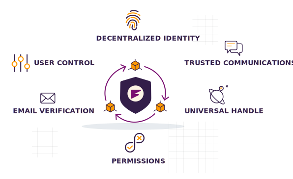

# Secure, Decentralized Sign-In For Your App

Sign-in With Frequency (SIWF) allows you to enhance your app with seamless and secure user authentication. It provides a simple identity solution that puts users in control of their data, enhancing trust and security while embracing the future of user authentication.

## What is Sign-In with Frequency?

Sign-in With Frequency (SIWF) provides the tools to integrate an easy-to-use single sign-on solution for users of the Frequency ecosystem.

By leveraging SIWF, you can offer users a seamless experience, making it easier for them to engage with your application without confronting the complexities of blockchain technology. SIWF streamlines the authentication process, allowing users to access a growing ecosystem of applications effortlessly while maintaining sovereign control over their personal data and identity.

### Key Features

#### Easy Integration:

- Utilize developer-friendly documentation, SDKs, and tools to quickly add SIWF to your applications with minimal effort.

#### Secure Authentication:

- SIWF uses cryptographic signatures to verify users, ensuring a secure authentication process without complex identity management systems.
- You can receive verified credentials, like an email address, to enhance communication and security.

#### Universal Identity:

- Offer users a familiar and standardized sign-in experience with a consistent UI.
- Allow users to effortlessly claim their universal handle and establish a unique identity across the entire Frequency ecosystem.

#### User Control and Trust:

- Ensure users maintain control over their own data as they grant specific permissions (delegations) and credentials to applications.
- Build trust with your users through radical transparency.

#### Reduced Onboarding Friction:

- Offer a familiar sign-in process that reduces barriers to entry, encouraging more users to engage with your application.

## How It Works

The authentication flow is simple and secure, involving your application, an SIWF service (like Frequency Access), and the Frequency blockchain.

1.  Your application directs the user to an SIWF Authentication URL.
2.  The SIWF service verifies the user, who then signs the requested permissions.
3.  The service sends the signed user payloads back to your application's secure backend.
4.  Your application's backend, using a service like the **Account Service**, can validate the response and, if needed, register the user on Frequency.
5.  Your application logs in the user, and their authenticated session begins.

## Developer Resources

Ready to build? We have everything you need to get started.

- **[SIWF v2 Documentation →](https://.....)**
- **[Get the SDKs (Web, iOS, Android) →](https://.....)**
- **[Account Service Documentation →](https://,,,,,)**
- **[JavaScript Quick Start →](https://...)**
